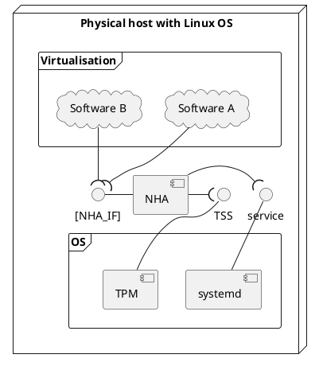
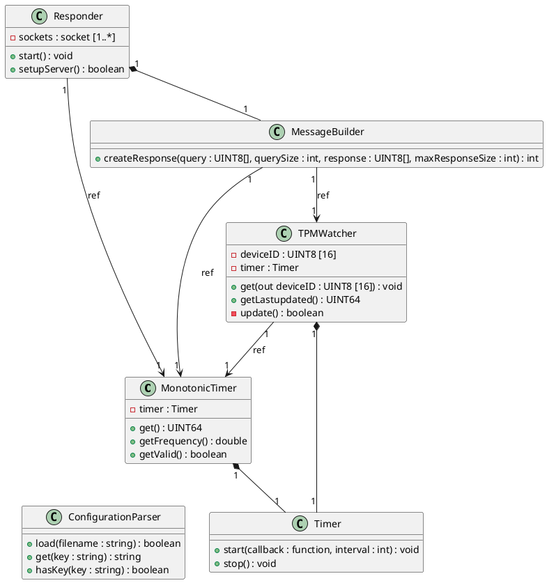
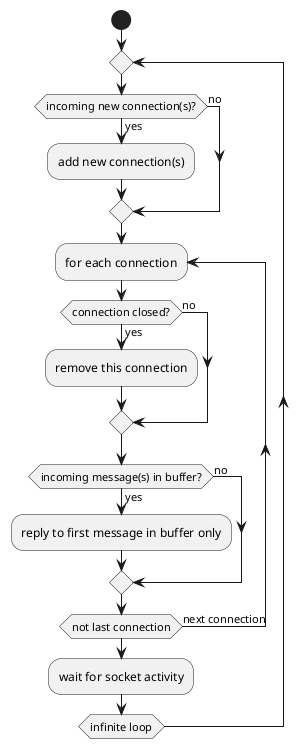
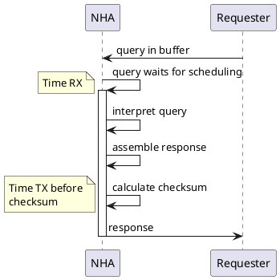

<!--
SPDX-FileCopyrightText: Copyright DB InfraGO AG
SPDX-License-Identifier: Apache-2.0
-->

# Purpose

In this document, the software design of the Native Hardware Access
(**NHA**) component is detailed for the purpose of implementation.

[[_TOC_]]

# Context

The Native Hardware Access (**NHA**) is a software component that is
intended to provide special information for other software running on
the same physical machine.

Its main functions are:

- Provide responses to queries of information
- Construct the Device-ID using the Trusted Platform Module (TPM)
- Provide a reliable strictly monotonic increasing timer

The NHA shall expect queries for the monotonic time. The NHA shall
assemble responses based on data in accordance with
[the Device-ID description](#the-device-id) and
[the Monotonic Timer description](#the-monotonic-timer). As the response is
time-critical, the NHA shall make best effort to minimize response time.



`Figure 1: Overview of the NHA and its interfaces.`

The NHA implementation provides TCP (RFC 9293) as the transport layer protocol. A connection as defined in the IF is a TCP connection.

# Functional description

## Structural View

The NHA is implemented as a C++ program, where clear
responsibilities can be assigned to specific classes.



`Figure 2: Class diagram of the NHA`

### Class Responder

This class is responsible for the main message loop. It maintains a list
of currently connected peers and schedules responding to incoming
messages from said peers. In order not to starve any peer, the
scheduling will check each connection in a round-robin pattern and only
answer to a maximum of one message from each peer, then moves to check
the next connection. At the start of a loop repetition, incoming new
connections are added, if the maximum number of connections is not yet reached.
During the checking for incoming queries, broken connections are removed.
When a loop is finished, the Responder will
enter a waiting period using the blocking “poll” system call to observe
all known sockets. Once any socket has incoming data, a new loop can
begin.



`Figure 3: Activity diagram of the main message loop of Class Responder`

The Responder listens for new connecting peers on a TCP server socket;
the address and port are configurable ([see Configuration](#configuration)). Please note, that you **must** initialise the Responder with `setupServer` before calling `start`. Failure to do so results in undefined behavior.

The advantage of serving incoming messages in this sequential manner is
that the software will remain simple with minimal performance overhead,
while keeping delays to an acceptable level.

### Class MessageBuilder

This class is responsible for constructing an appropriate response to a
given query. It receives the query and returns the response as raw
bytes; therefore, this class also implements the decoding and encoding
of the Tag-Length-Value (**TLV**) protocol [\[NHA_IF\]](./NHA_IF.md). The calculation of MD5 checksums is done
using OpenSSL. See ["Query-Response communication"](#query-response-communication) for details on message creation.

### Class TPMWatcher

This class is responsible for keeping an up to date “Device-ID” value on
hand. Since the creation of the “Device-ID” requires access to the
Trusted Platform Module, it is a costly operation. Therefore, this class
will periodically re-create this value and store it internally. This
update loop must also be asynchronous to not block the execution of the
main thread, which handles the incoming and outgoing messages. Thread
safety must also be observed when accessing the stored value (i.e. an
atomic variable). See [the Device-ID description](#the-device-id) for details on TPM usage.
The class also stores the timestamp when the "Device-ID" was last updated.

### Class MonotonicTimer

This class is responsible for deriving a strictly monotonic increasing
timer from information from the CPU. It is imperative that this
calculation be quick, with at least millisecond precision and nanosecond
resolution. See [the Monotonic Timer description](#the-monotonic-timer) for details on the calculation.

This class is also capable of checking whether the current CPU can
provide the required information for the NHA to function.

### Class Timer

This class implements a Timer which periodically calls a provided function in a separate thread.
The period is set by the user in milliseconds. When `start` is called, the callback will only be executed after the first period.

### Class ConfigurationParser

This class is responsible for parsing the configuration file described in [the Configuration section](#configuration) and providing key-value pairs.
The user should make sure that the key exists with the `hasKey` method before calling `get`, as accessing a missing key results in a runtime error.

## Deployment View

The NHA shall run as a new-style systemd daemon.

Note: see
https://www.freedesktop.org/software/systemd/man/latest/daemon.html#New-Style%20Daemons

To provide information as intended, the NHA shall run in a
non-virtualized environment. The host must also have a physical Trusted
Platform Module (**TPM**) installed and configured for use.

The NHA is distributed as a Debian package. The package contains the
files detailed in the table below. The package also sets up the NHA to
start as a service during the host startup process and an "nha:nha" user
for the service to use. This user can have an unspecified User ID.

<table>
<colgroup>
<col style="width: 38%" />
<col style="width: 16%" />
<col style="width: 18%" />
<col style="width: 25%" />
</colgroup>
<thead>
<tr class="header">
<th><strong>Filename</strong></th>
<th><strong>Location</strong></th>
<th><strong>Permissions</strong></th>
<th><strong>Usage</strong></th>
</tr>
</thead>
<tbody>
<tr class="odd">
<td>nha</td>
<td>/usr/sbin</td>
<td>755; root:root</td>
<td>Main executable</td>
</tr>
<tr class="even">
<td>nha.service</td>
<td>/usr/lib/systemd/system</td>
<td>644; root:root</td>
<td>Service file of the NHA</td>
</tr>
<tr class="odd">
<td>nha.conf</td>
<td>/etc</td>
<td>644; nha:nha</td>
<td>Configuration file of the NHA</td>
</tr>
</tbody>
</table>

`Table 1: Files installed by the NHA package`

### Dependencies

The NHA has the following requirements to function:

- the CPU of the hardware must support invariant TSC and the RDTSC instruction
- The operating system must be configured to permit the application's access to the perf API
- the hardware must have a TPM chip that supports TSS 2.0 or greater
- the Linux operating system must have TCG's TPM2 Software Stack Enhanced System API (`tss2-esys`) library installed
- OpenSSL must be installed

## Information and Data Flow

### The Device-ID

The NHA shall obtain the Device ID from the Trusted Platform Module. The
Device ID shall be derived from the TPM Name of the endorsement primary
key. The TPM Name is read via the TSS
`Esys_ReadPublic` function, and the resulting SHA-256 hash (after
stripping the 2-byte algorithm identifier prefix) is folded into 16
bytes by XORing its first and second halves.

For details on the exact Device-ID calculation, see the protocol
definition [\[NHA_IF\]](./NHA_IF.md).

As the construction of the Device-ID can be a time-consuming task, the
NHA shall periodically retrieve and store the Device-ID. This way, the
data can be used instantly when responding to a query.

To obtain the Device ID from the Trusted Platform Module, the NHA shall
use TCG's TPM2 Software Stack Enhanced System API (`tss2-esys`) in its implementation.

### The monotonic timer

The NHA shall provide monotonic time. This shall not be affected by
adjustments, such as leap seconds.

To obtain monotonic time, the NHA shall query the invariant Time Stamp
Counter (**TSC**) of the CPU.

This Invariant Time Stamp Counter, otherwise known as Constant Rate Time
Stamp Counter, is simply a CPU register that counts the number of
elapsed CPU cycles. Its invariance refers to the fact that it always
uses the CPU's nominal frequency, regardless of, for example, power
saving options. It is therefore a reliable source of time, and the NHA
will simply use the momentary contents of this register and the TSC
frequency to calculate the monotonic timer.

The capabilities of a CPU can be checked using the CPUID instruction.
An Invariant TSC is indicated by a specific bit in the leaf "Processor Power Management Information and RAS Capabilities".
The CPU must also support the RDTSCP
instruction, which is indicated by a specific bit in the leaf "Extended Processor Info and Feature Bits".
The NHA will check these above
conditions to ensure that it can provide a reliable strictly monotonic
timer. In case any of the above checks fail, the NHA is incapable of
operation and must shut down with appropriate logging.

At startup, the TSC frequency is determined by querying the perf API. Subsequently, the TSC frequency is periodically
calculated based on elapsed TSC cycles and the operating system's reported time. If this calculated frequency deviates
from the initially obtained frequency by a configurable percentage, the application considers the time source
unreliable and stops serving clients. Both the frequency calculation period and the acceptable deviation percentage are
configurable parameters within the application's configuration file.

### Query-Response communication

The queries and responses of the NHA shall use the
[\[NHA_IF\]](./NHA_IF.md) protocol.
For the details of the communication protocol and examples, see the
above specification.

For a query message at hand, the following steps constitute the assembly
of a response:

1. Take time of receipt from monotonic timer, as this is the earliest possible moment
2. Verify incoming query checksum
3. Interpret incoming query
4. Assemble response according to incoming query
5. Take time of transmission from monotonic timer, as this is the last moment when we can modify the message
6. Calculate checksum for our response and if requested, XOR it with Device-ID



`Figure 4: Sequence diagram of query-response`

## Additional considerations

### Restriction to single core

In order to make absolutely sure that the TSC value remains consistent, the NHA will, during initialisation, restrict it's own process to use only the first available CPU core. This will, of course, respect any additional constraints set by the user.

# Non-functional Aspects

## Security

In the provided service file, the specified capabilities must be minimal for the functionality of the NHA and the NHA
must be executed as user "nha". The application requires kernel.perf_event_paranoid to be set to 2 or lower, and it must
be granted the CAP_PERFMON capability to be able to use the linux `perf API` for reading TSC frequency. This is required for the NHA to function.

## Logging

The NHA uses standard logging methods and practices regarding systemd
services. This includes the usage of `sd_notify` to supply `STATUS` updates and the usage of `READY=1` once initialisation is complete.

Fatal errors must be logged, as they will cause the NHA
service to restart. These failures are:

- The CPU does not provide an invariant TSC or the TSC frequency can not be measured.
- The NHA can not open its server socket.
- The initial creation of the DeviceID using the TPM is unsuccessful.

Errors such as, but not limited to, failure to
provide a supported TLV record, and unexpected but recoverable network
errors are also logged.

# Interfaces

## External Interfaces

The NHA uses the [\[NHA_IF\]](./NHA_IF.md) protocol to communicate with its peers
via TCP.

TCG's TPM2 Software Stack Enhanced System API (`tss2-esys`) is used to access the hardware Trusted
Platform Module.

The MD5 checksum calculation is done using OpenSSL library calls.

The monotonic timer subcomponent uses the Linux kernel perf API interface to obtain TSC frequency.

## Configuration

The configuration file must be supplied with the mandatory `-c` argument. By default, the service file refers to the `/etc/nha.conf` file.

The configuration file consists of key-value pairs. Each line defines one pair, where the first word is the key, followed by a whitespace, and the rest of the line is the value. It is therefore possible to have whitespaces in the value, but not the key.
Comments are indicated by using a `#` character at the start of the line. Empty lines are ignored.

The following is a full example of the configuration file described [in the deployment view](#deployment-view), which also showcases the default value for each possible configuration parameter:

```bash
host 0.0.0.0
port 7872
transport tcp
max_connections 100
tpm_interval_in_ms 60000
tsc_check_interval_in_ms 60000
tsc_check_deviation_threshold 0.001
```
*Note:* the `transport` setting only supports `tcp` as of now.
